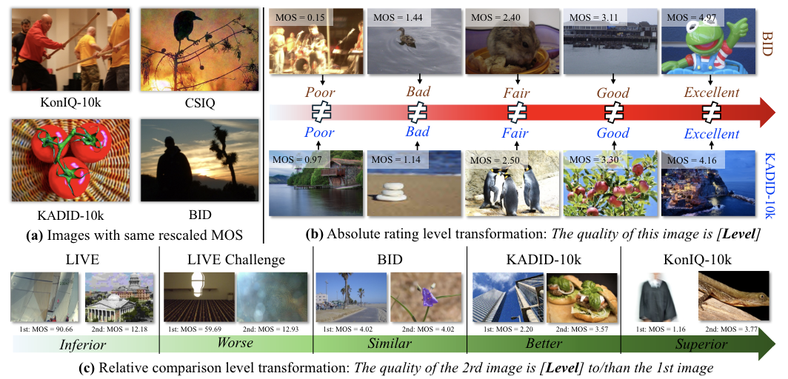
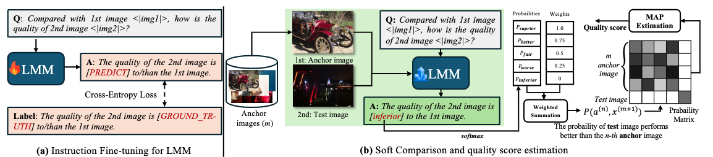
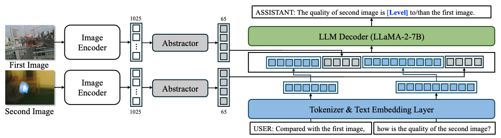

 <div>


  <a href="https://github.com/Q-Future/Compare2Score"></a>
    <a href="https://arxiv.org/abs/2405.19298"></a>
    <a href="https://huggingface.co/q-future/Compare2Score"></a>
   </div>

<div align="center">
  <h1>Adaptive Image Quality Assessment via Teaching Large Multimodal Model to Compare</h1> 
    
<div style="width: 80%; text-align: center; margin:auto;">
      
</div> 
    
<!-- <a href="https://huggingface.co/spaces/teowu/OneScorer">One Unified Model for Visual scoring.</a> -->

  <div>
    <a href="https://h4nwei.github.io/" target="_blank">Hanwei Zhu</a><sup>1</sup><sup>*</sup>,
      <a href="https://teowu.github.io/" target="_blank">Haoning Wu</a><sup>2</sup><sup>*</sup>,
      <a href="https://github.com/Yixuan423/" target="_blank">Yixuan Li</a><sup>1</sup>,
      <a href="https://zzc-1998.github.io/" target="_blank">Zicheng Zhang</a><sup>3</sup>,
      <a href="https://scholar.google.com/citations?hl=en&user=w_WL27oAAAAJ&view_op=list_works" target="_blank">Baoliang Chen</a><sup>1</sup>,
      <a href="https://scholar.google.com/citations?hl=en&user=IhyTEDkAAAAJ" target="_blank">Lingyu Zhu</a><sup>1</sup>,

  </div>
    

<div>
        <a href="http://sim.jxufe.cn/JDMKL/ymfang_EN.html/" target="_blank">Yuming Fang</a><sup>4</sup>,
      <a href="https://ee.sjtu.edu.cn/en/FacultyDetail.aspx?id=24&infoid=153&flag=153" target="_blank">Guangtao Zhai</a><sup>3</sup>,
      <a href="https://personal.ntu.edu.sg/wslin/Home.html" target="_blank">Weisi Lin</a><sup>2</sup>,
      <a href="https://www.cs.cityu.edu.hk/~shiqwang/" target="_blank">Shiqi Wang</a><sup>1</sup><sup>#</sup>

  </div>
  <div>
  <sup>1</sup>City University of Hong Kong <sup>2</sup>Nanyang Technological University, <sup>3</sup>Shanghai Jiao Tong University, <sup>4</sup>Jiangxi University of Finance and Economics
       </div>   
<div>
<sup>*</sup>Equal contribution.  <sup>#</sup>Corresponding author. 
   </div>
    
<div>
   <a href="https://HuggingFace.co/q-future/Compare2Score"><strong>Compare2Score (HF Model)</strong></a>  |  <a href="https://arxiv.org/abs/2405.19298"><strong>Arxiv</strong></a> | <a href="https://compare2score.github.io/"><strong>Homepage</strong></a> 
   </div>   
    
    
    
<!-- <h2>Results</h2> 
<div style="width: 75%; text-align: center; margin:auto;">
      
</div>  -->

  <h2>Motivation</h2> 

<div style="width: 100%; text-align: center; margin:auto;">
      
</div>

<h2>Training & Inference</h2> 

<div style="width: 100%; text-align: center; margin:auto;">
      
</div>

<h2>Structure</h2> 

<div style="width: 100%; text-align: center; margin:auto;">
      
</div>
</div> 

<!-- ## [Important Note!] v1.1 <-> transformers==4.36.1+

```shell
git pull
pip install -e .
``` -->

## Quicker Start with Hugging Face AutoModel

No need to install this GitHub repo. 

```python
import requests
import torch
from transformers import AutoModelForCausalLM

model = AutoModelForCausalLM.from_pretrained("q-future/Compare2Score", trust_remote_code=True, torch_dtype=torch.float16, device_map="auto")

from PIL import Image
image_path_url = "https://raw.githubusercontent.com/Q-Future/Q-Align/main/fig/singapore_flyer.jpg"
print("The quality score of this image is {}".format(model.score(image_path_url)) 
```


## Installation

Evaluation:

```shell
git clone https://github.com/Q-Future/Compare2Score.git
cd Compare2Score
pip install -e .
```

Training:

```shell
pip install -e ".[train]"
pip install flash_attn --no-build-isolation
```

## Visual Quality Scorer


```python
from q_align import Compare2Scorer
from PIL import Image

scorer = Compare2Scorer()
image_path = "figs/i04_03_4.bmp"
print("The quality score of this image is {}.".format(scorer(image_path)))
```


## Training & Evaluation

### Get Datasets

Download all IQA datasets and training JSONs

```python
import os, glob
from huggingface_hub import snapshot_download


snapshot_download("VQA-CityU/IQA_data", repo_type="dataset", local_dir="./playground/data", local_dir_use_symlinks=False)

gz_files = glob.glob("playground/data/*.zip")

for gz_file in gz_files:
    print(gz_file)
    os.system("unzip ./playground/data/".format(gz_file))
```


### Evaluation


After preparing the datasets, you can evaluate pre-trained **Compare2Score** as follows:


```shell
python q_align/evaluate/IQA_dataset_eval.py --model-path VQA-CityU/Compare2Score_1--device cuda:0
```


### Training from Scratch


```shell
sh scripts/train_bid_csiq_clive_kadid_koniq_live_compare.sh
```


## Citation

```bibtex
@article{zhu2024adaptive,
  title={Adaptive Image Quality Assessment via Teaching Large Multimodal Model to Compare},
  author={Zhu, Hanwei and Wu, Haoning and Li, Yixuan and Zhang, Zicheng and Chen, Baoliang and Zhu, Lingyu and Fang, Yuming and Zhai, Guangtao and Lin, Weisi and Wang, Shiqi},
  journal={arXiv preprint arXiv:2405.19298},
  year={2024},
}
```
